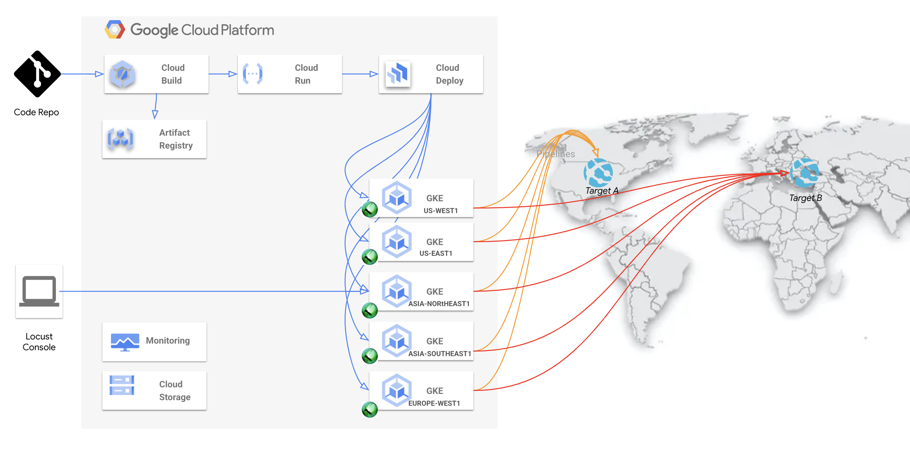

# Global Distributed Testing

## Description

Global Distributed Testing is a project to leverage GKE Autopilot to build up a global distributed testing capability. The testing framework here is based on [Locust](https://locust.io/), which could be replace as per requirement. The testing is going to be triggered by 'git commit' after provisioning infra & configuration. 

## High Level Architecture




## Guide

```bash
# 0. Modify gke-config to specify where you want to simulate testing.
vi ./hack/gke-config 

# 1. Provision targeting applications for Load testing
./hack/setup-boutique.sh

# 2. Provision Distributed Testing
gcloud builds submit --config=./cloudbuild-all.yaml

# 3. Waiting outputs for testing endpoit

```

## Clean Up

```bash

./hack/destroy.sh

```